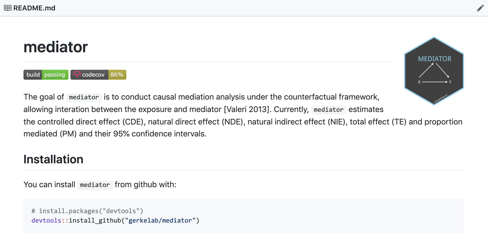
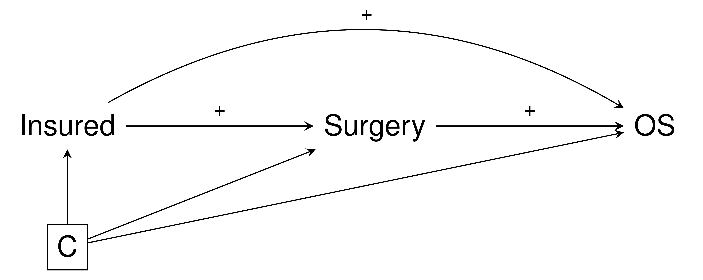
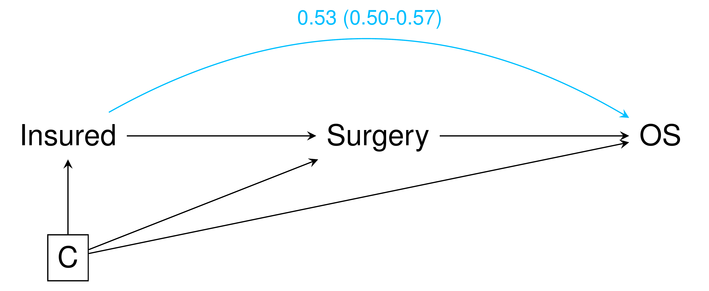
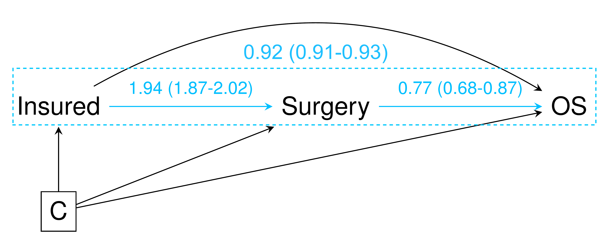
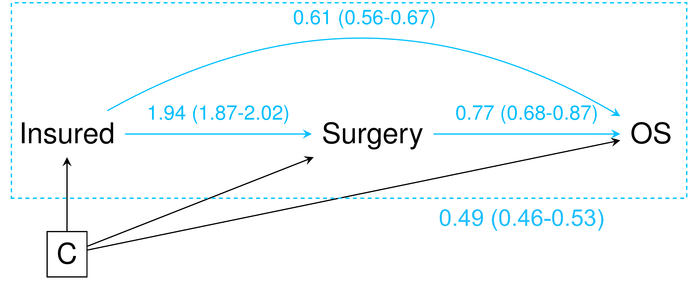

```{r xaringan-themer, include = FALSE}
library(xaringanthemer)
duo_accent(primary_color = "#F09749", secondary_color = "skyblue")
# mono_accent(base_color = "skyblue")
```

```{r setup, include=FALSE}
knitr::opts_chunk$set(
  fig.width = 10, fig.height = 6, fig.retina = 2,
  warning = FALSE, message = FALSE
)

xaringanExtra::use_xaringan_extra(c("animate_css", "text_poster", "panelset"))
xaringanExtra::use_tachyons()
```

class: center middle hide-count hide-logo
background-image: url(figures/moffittlogo.png) 
background-size: 15%
background-position: bottom 5% right 5%

<div class="talk-logo"></div>

.talk-meta[
  .talk-title[# mediator <br> <br> .smaller[an R package for conducting <br> causal mediation analyses]]

  .talk-author[Jordan Creed]
  
  .talk-date[ @jhcreed]
]

???

---

## Mediation analysis

Examines an exposure and outcome through an intermediate variable (mediator) 

Causal relationship 
+ Understanding the mechanics behind an association 
+ NOT prediction
    
Goal of mediation analysis: Estimate the direct and indirect effects 

.h-center[

]


---

## Diected Acyclic Graphs (DAGs)

.w-75.h-center[

]

DAGs contain variables of interest and common causes

Quickly assess assocations between variables 

Rules for reading DAGs 
+ .accent-blue[ Modern Epidemiology - Chapter 12 ]
+ .accent-blue[ Causal Inference - https://www.hsph.harvard.edu/miguel-hernan/causal-inference-book/ ] 

.footnote.pull-left[Tool for drawing DAGs: https://apps.gerkelab.com/shinyDAG/]

---

## Classic mediation analysis

Baron and Kenny aka the product method 
+ https://www.sesp.org/files/The%20Moderator-Baron.pdf
+ Over 90,000 citations 

Criteria to be a mediator: 
+ Changing the exposure change the mediator (Race -> Access/ QoC) 
+ The mediator affect the outcome (Access / Qoc -> Lethal outcomes)
+ Changing the exposure change the outcome .accent-blue[ ( `r emo::ji("grimacing")` unless the indirect and direct effects cancel out) ]
+ After controlling for the mediator, the previously significant relationship between the exposure and the outcome is no longer significant .accent-blue[ ( `r emo::ji("grimacing")` unless it partial mediaton) ]

.w-75.h-center[

]


---

background-image: url(figures/bk_dag.png)
background-size: 32%
background-position: 95% 12%

## Baron and Kenny approach 

If .accent-orange[ A ] is the exposure, .accent-orange[ Y ] the outcome, .accent-orange[ M ] the mediator and .accent-orange[ C ] the covariates
+ Y and M are continuous
    
Step 1: Fit E[M] = $\beta_{0}$ + $\beta_{1} a$ + $\beta_{2} c$

Step 2: Fit E[Y] = $\theta_{0}$ + $\theta_{1} a$ + $\theta_{2} m$ + $\theta_{4} c$

Direct effect = $\theta_{1} a$
+ Direct effect is the exposure effect on the outcome at a fixed level of the mediator

Indirect effect = $\theta_{2} \beta_{1}$
+ Indirect effect is the effect on the outcome of changes of the exposure which operate through the mediator

`r emo::ji("point_right")` .accent-blue[Does not accommodate exposure-mediator interactions]

---
class: center middle

.dramatic[
Causal  
Inference   
Methods
]


---

background-image: url(figures/bk_dag.png)
background-size: 32%
background-position: 95% 12%

## Allowing exposure-mediator interactions

Step 1: Fit E[M] = $\beta_{0} + \beta_{1} a + \beta_{2} c$ 
+ .accent-blue[same as previously]

Step 2: Fit E[Y] = $\theta_{0} + \theta_{1} a + \theta_{2} m + \theta_{3} am + \theta_{4} c$

.accent-blue[Assuming a binary exposure changing level a* = 0 to a = 1]


> Controlled direct effect = $( \theta_{1} + \theta_{3} m)(a - a^{*})$

> Natural direct effect = $\{ \theta_{1} + \theta_{3} ( \beta_{0} + \beta_{1} a^{*} + \beta_{2} c) \}(a - a^{*})$

> Natural indirect effect = $( \theta_{2} \beta_{1} + \theta_{3} \beta_{1}a) (a - a^{*})$


`r emo::ji("point_right")` When no exposure-mediator interaction is present, $\theta_{3}$ = 0
+ CDE = NDE = $\theta_{1}$ and NIE = $\theta_{2} \beta_{1}$
+ .accent-blue[Same as the direct and indirect effects in Baron and Kenny]

---

## Interpreting the estimates

Controlled direct effect = $( \theta_{1} + \theta_{3} m)(a - a^{*})$
+ How much the outcome would change if exposure changed from a∗ to a and the mediator were controlled at level m in the population

Natural direct effect = $\{ \theta_{1} + \theta_{3} ( \beta_{0} + \beta_{1} a^{*} + \beta_{2} c) \}(a - a^{*})$
+ How much the outcome would change if exposure were set at level a versus a∗ but for each individual the mediator were kept at the level it would have taken in the absence of exposure

Natural indirect effect = $( \theta_{2} \beta_{1} + \theta_{3} \beta_{1}a) (a - a^{*})$
+ How much the outcome would change if exposure were controlled at level a but the mediator were changed from the level it would take with a∗ to the level it would take with a

Total effect of A = NDE + NIE 
---

## Mediation or confounding ...

.w-75.h-center[

]

---

## Mediation or confounding ...

.h-center[

]

???

JAMA ONCOLOGY

Confounder: variables that are related to both the intervention and the outcome, but are not on the causal pathway
Mediator: on the causal pathway
"... we adjusted for cancer and treatment-related confounders ..."

---

background-image: url(figures/tear-emoji.png)
background-size: 20%
background-position: 50% 75%

## Mediation or confounding ...

.h-center[

]

---

## mediator - https://github.com/GerkeLab/mediator

.h-center[

]

??? 

Explain the goals for the package, its outputs and installation

---

# mediator - quick start 

Required arguments 
+ `data = ` the data for performing the analysis 
+ `out.model = ` fitted model object for the outcome
    + `glm`, `lm` or `coxph`
+ `med.model = ` fitted model object for the mediator
    + `glm` or `lm`
+ `treat = ` character string indicating the name of the treatment/exposure variable

Default arguments
+ `a = ` numeric value indicating the exposure level
    + default = 1
+ `a_star = ` numeric value indicating the compared exposure level
    + default = 0
+ `m = ` numeric value indicating the level of the mediator
    + default = 1
+ `boot_rep = ` numeric value indicating the number of repetitions to use when utalizing bootstrap to calculate confidence intervals
    + deault = 0 (Delta method)
    
---

## Is the effect of being insured on overall survival mediated through surgery in prostate cancer ...

Based on > 500,000 prostate cancer cases in the National Cancer Data Base
+ Those who are insured are more likely to receive surgery than those who are uninsured
+ Those who are insured have better overall survival than those who are uninsured
+ Those who receive surgery have better overall survival than those who do not receive surgery

.w-75.h-center[

]

---

## Is the effect of being insured on overall survival mediated through surgery in prostate cancer ...

```{r, eval=FALSE}
library(mediator)
library(tidyverse)
library(survival)

dat %>% 
  # do some data cleaning here ...
  mediator(out.model = coxph(Surv(DX_LASTCONTACT_DEATH_MONTHS, death) ~
                              insured + surgery + 
                              PSA + cGleasonSum + AGE + racev2 + 
                              (insured*surgery), 
                            data = .),
           med.model = glm(surgery ~ insured +
                            PSA + cGleasonSum + AGE + racev2, 
                            data = ., family = "binomial"),
                   treat = "insured")
```

.footnote.pull-left[Full code available at: https://github.com/jhcreed/bsp2020-mediator]

---

## Is the effect of being insured on overall survival mediated through surgery in prostate cancer ...

```{r, echo=FALSE, message = FALSE, warning=FALSE}

library(mediator)
library(tidyverse)
library(survival)
library(kableExtra)

load("/Volumes/creedja/NCDB/ACSgrant/gleasonUpgrading/data/raw.Rdata")

dat_clean <- dat %>%
  filter(RACE %in% c(1,2)) %>%
  mutate(RACE = recode(RACE,
                       `1`="White",
                       `2`="Black")) %>%
  # clinical Gleason values
  mutate(cGleasonSum = ifelse(CS_SITESPECIFIC_FACTOR_8 %in% c(988,998,999),
                              NA,CS_SITESPECIFIC_FACTOR_8)) %>%
  # shivs filtering (can probably be less stringent)
  filter(HISTOLOGY %in% c(8140, 8255, 8147, 8310, 8480, 8500, 8550, 8560, 8200) & 
           BEHAVIOR == 3 & DIAGNOSTIC_CONFIRMATION == 1) %>% 
  filter(!is.na(PUF_VITAL_STATUS) & !is.na(DX_LASTCONTACT_DEATH_MONTHS)) %>% 
  filter(!(TNM_CLIN_M %in% c("c1", "c1A", "c1B", "c1C"))) %>% 
  # only those with private insurance or no insurance/medicaid
  filter(INSURANCE_STATUS %in% c(0, 1, 2)) %>%
  mutate(insured = case_when(
    INSURANCE_STATUS == 1 ~ 1,
    TRUE ~ 0
  )) %>% 
  mutate(surgery = case_when(
    REASON_FOR_NO_SURGERY == 0 ~ 1,
    REASON_FOR_NO_SURGERY %in% c(1,2,6,7,8) ~ 0,
    TRUE ~ NA_real_
  )) %>%
  # filtering based on having values needed for analysis
  filter(!is.na(DX_RX_STARTED_DAYS)) %>%
  mutate(racev2 = ifelse(RACE=="Black",1,0)) %>%
  # fix PSA
  mutate(PSA = ifelse(CS_SITESPECIFIC_FACTOR_1>990,NA,CS_SITESPECIFIC_FACTOR_1/10)) %>%
  # cleaning death
  # include death
  mutate(PUF_VITAL_STATUS = recode(PUF_VITAL_STATUS,
                                   `0` = "Dead",
                                   `1` = "Alive")) %>%
  mutate(death = ifelse(PUF_VITAL_STATUS=="Dead",1,
                        ifelse(PUF_VITAL_STATUS=="Alive",0,NA))) 

mediator(data = dat_clean,
         out.model = coxph(Surv(DX_LASTCONTACT_DEATH_MONTHS, death) ~
                            insured + surgery + 
                            PSA + cGleasonSum + AGE + racev2 + 
                            (insured*surgery), 
                          data = dat_clean),
         med.model = glm(surgery ~ insured +
                           PSA + cGleasonSum + AGE + racev2, 
                           data = dat_clean, family = "binomial"),
         treat = "insured") %>%
  replace_na(list(`Lower 95% CI` = "",
                  `Upper 95% CI` = "")) %>%
  kable() %>%
  kable_styling(full_width = F) %>% 
  row_spec(0, background = "skyblue", color = "black", align = "c") %>% 
  row_spec(1:5, bold = T, background = "white", align = "c")

```

<br>

`r emo::ji("point_right")` The number of potential estimates for the CDE is equal to the number of levels that the mediator can take  
+ CDE of being insured compared to uninsured when forcing surgery not to occur is 0.47 (0.42-0.52)
+ CDE of being insured compared to uninsured when forcing surgery to occur is 0.61 (0.56-0.67)

.footnote.pull-left[Full code available at: https://github.com/jhcreed/bsp2020-mediator]

---

## Is the effect of being insured on overall survival mediated through surgery in prostate cancer ...

NDE:  the effect of the exposure (insured) on the outcome (overall survival) if the pathway from the exposure to the mediator (surgery) was removed
+ HR for being insured compared to uninsured, when each individual's surgical status is kept at the level it would take in the absence of insurance status, is 0.53 (0.50-0.57)

.w-70.h-center[

]


---

## Is the effect of being insured on overall survival mediated through surgery in prostate cancer ...

NIE: the effect of the exposure (insured) that operates by changing the mediator (surgery)
+ HR for being insured, if surgical status was changed from the level it would take if insurance status was uninsured to the level if insurance status was insured, is 0.92 (0.91-0.93)


<br>

.w-75.h-center[

]


---

## Is the effect of being insured on overall survival mediated through surgery in prostate cancer ...

TE:  the overall effect of the exposure (insured) on the outcome (overall survival)
+ HR for insured compared to uninsured, overall, is 0.49 (0.46-0.53)

<br>

.w-75.h-center[

]

---

## SAS, STATA and R - Oh My!

`mediator` is the sister program of `%mediator` the SAS/SPSS macro developed by Valeri and VanderWeele 

Confidence Intervals 
+ `%mediator` uses hard coded `1.96` and `-1.96` while `mediator` uses  `c(-1,1)*qnorm(.975)` for the Delta method
+ during bootstrapping, `%mediator` bootstraps effect estimates and CIs while `mediator` only bootstraps the CIs
+ minor differences due to rounding 
    
Speed differences 
+ `mediator` up to 1000x faster than `%mediator` when using bootstrapping

Covariates
+ `%mediator` uses dummy variables for multi-level factors while `mediator` allows multi-level and character variables in models 

`mediation` R package
+ different set of terminology 
+ different estimation approach

---

## Package == Reproducibility

Easy to share and implement new methods

R packages are more than just a bundle of code : tests, data, documentation, ...

.h-center[
 
]

---

## GitHub

.h-center[
 
]

---

## GitHub

.h-center[
 
]

---

## GitHub

.h-center[
 
]

---

.h-center[

]


```{css, echo=FALSE}
.talk-logo {
  width: 480px;
  height: 556px;
  position: absolute;
  top: 5%;
  left: 50%;
  background-image: url('figures/mediator_hex.png');
  background-size: cover;
  background-repeat: no-repeat;
}
.talk-meta {
  #font-family: Overpass;
  position: absolute;
  text-align: left;
  bottom: 10px;
  left: 25px;
}
.talk-author {
  color: #444;
  font-weight: bold;
  font-size: 1.5em;
  line-height: 1em;
}
.talk-date {
  color: #666;
  font-size: 1.25em;
  line-height: 0;
}
.hide-count .remark-slide-number {
  display: none;
}

# sizing 
.w-50 {
  width: 50%;
}
.w-25 {
  width: 25%;
}
.w-75 {
  width: 75%;
}
.w-70 {
  width: 70%;
}
.w-115 {
  width: 115%;
}
.h-center {
  margin: 0 auto;
}
.top-0    { top:    0; }
.right-0  { right:  0; }
.bottom-0 { bottom: 0; }
.left-0   { left:   0; }

# colors

.accent-other { 
  color: light brilliant orange,
}
.accent-orange { 
  color: #f09749; 
}
.accent-blue { 
  color: #00bfff ;
}


.dramatic p {
  font-size: 145px;
  color: #00bfff ;
  margin-top: 0;
  margin-bottom: 0;
}

```